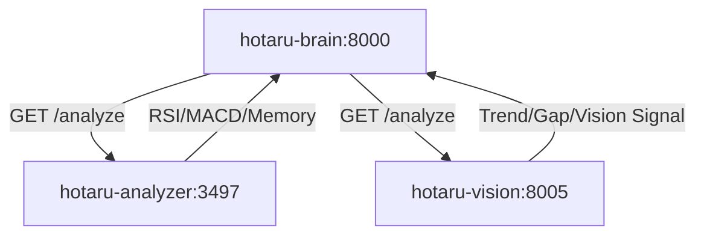

# 🧠 Hotaru Fund - System Connection Log
**Date:** 2026-04-24
**Status:** 🟢 Connected (Rewritten)

## 🏗️ Architecture Overview
ระบบการเชื่อมต่อถูกปรับปรุงใหม่ให้สื่อสารกันผ่าน JSON แบบ Structured Data เพื่อความแม่นยำในการตัดสินใจของ AI

## 📡 Service Endpoints
| Service | Language | Port | Main Responsibility |
| :--- | :--- | :--- | :--- |
| **hotaru-brain** | Python (FastAPI) | `8000` | ตัวกลางประสานงานและตัดสินใจ (Cerebras AI) |
| **hotaru-analyzer** | Rust (Actix) | `3497` | คำนวณ Technical Indicators & AI Memory |
| **hotaru-vision** | Python (FastAPI) | `8005` | วิเคราะห์ Trend ใหญ่ และส่วนต่างราคา (Arbitrage) |

## 🛠️ Connection Updates (Rewritten)
- **`service_clients.py`**: ปรับปรุงให้รับค่าเป็น JSON Object แทน String เพื่อให้เข้าถึงข้อมูลเชิงลึกได้โดยตรง
- **Rust Integration**: เชื่อมต่อผ่าน `/analyze/{symbol}` โดยดึงค่า RSI และ `info_string` มาเป็นหลัก
- **Vision Integration**: เพิ่มการเช็ค `gap_pct` ระหว่าง Binance และ KuCoin เพื่อหาโอกาสทำกำไร

---
*บันทึกโดย โฮตารุ (Hotaru) 🦊✨*
